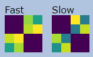
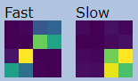
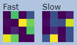
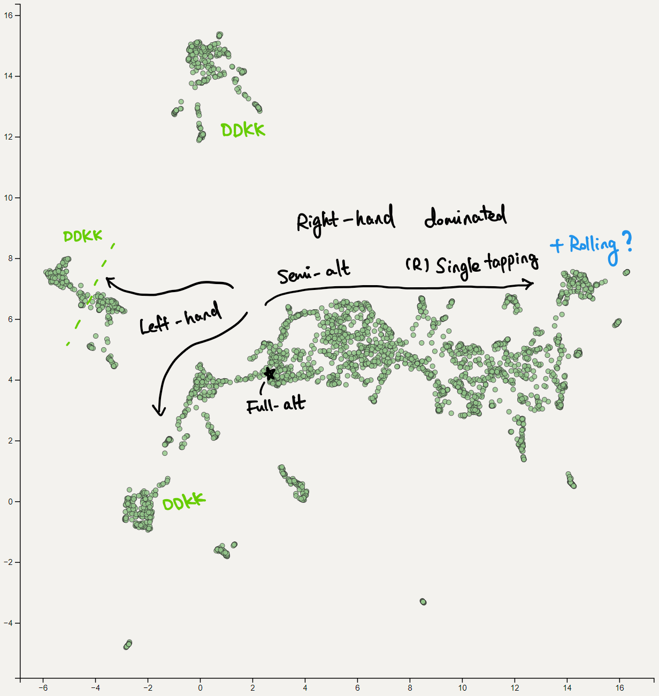

# osu!taiko playstyles

This might be a heavy interactive visualization to load, and best viewed on some PC. I have only tested it on my machine with Chrome, so be warned that there must have some problems ... ;x;

Most of top-1500 players in taiko mode are included. Some are not since I cannot download their replays ... sorry.

------

<iframe width = "900" height = "920" scrolling = 'no' src = "./pages/vis.html"/>

This is a simple visualization of some replays I have downloaded from the osu! website (taiko mode). This demo tries to analyze the playstyle from the replay, and the visualization plot is done in a specific way ([umap](https://umap-learn.readthedocs.io/en/latest/)), so that replays with similar "playstyle" (what so defined via my program) will stay close in the plot.

Top-1500 players' best performance 1 & 2 have been plotted.

Usage:

* To search a player, type their name in the input box and hit "Find". This will match all players whose name starts with the text you have typed, and highlight them in the plot. (case sensitive)
* Hit "Clear" to clear highlights.
* The tooltip will show 2 matrices, where brighter color corresponds to higher value in the matrix. The meaning of it will be introduced below.

> DISCLAIMER
>
> This is a pretty simple visualization with no whatsoever fancy technologies. Don't expect too much from it ...

Precisely, a "playstyle", which is defined as a collection of two $4 \times 4$ matrices, is produced from replays as follows:

* Each replay contains a sequence of keyhits with timestamps. There're 4 keys in total: left kat, left don, right don, right kat. This is what you have assigned in osu keybindings.
* Whenever a new key is pressed in the replay, the program will check both current keyhit and previous keyhit. The **"previous key -> current key" transition** (alternate?) is a key ingredient for the "playstyle" representation.
* There're 16 different possible transitions in total. By count the total amount of each type, we got a $4 \times 4$ matrix for a given replay.
* Besides, we also consider the time of the transition (i.e. time elapsed since last keyhit to current one). If the time is less than a given threshold, that transition will be counted into "**fast**" matrix; otherwise, it goes to the "**slow**" matrix. This gives us two $4 \times 4$ matrices.
* Finally to obtain a meaningful result we normalize those two matrices individually.

The time threshold is set to 107.91ms (= 1/4 note interval @ 139 BPM). This means if one is single-tapping 1/2s at 280BPM, it will be recorded into "fast" matrix.

The column (left -> right) and rows (up -> down) in those matrices are arranged as `lK, lD, rK, rD`.

Some examples:

**Full-alt**
Alternate patterns will concentrate on upper-right and lower-left, which corresponds to full-alting.

**Single tapping** (?)
For "slow" matrix, patterns will concentrate on dominating hands. In this plot, most people are using right hands for this...

**DDKK**
For those players the pattern mainly depends on their keybinds and some sub-playstyles (which I'm not that familiar of ;x;). What I could say is DDKK players in the plot are being divided into multiple clusters, and sometimes mixed with Left-hand dominated single tapping players. Below shows the matrices from applerss:

Finally a brief map I have made:

which I don't have much confidence. So if you find something wrong / mislabeled, please feel free to let me know xDD

### Side notes

* Yes, ghost tapping counts.
* Perhaps we should use some soft thresholding instead ... ?

By betairylia 2022-01-03
[github repo](https://github.com/betairylia/otSR-2)